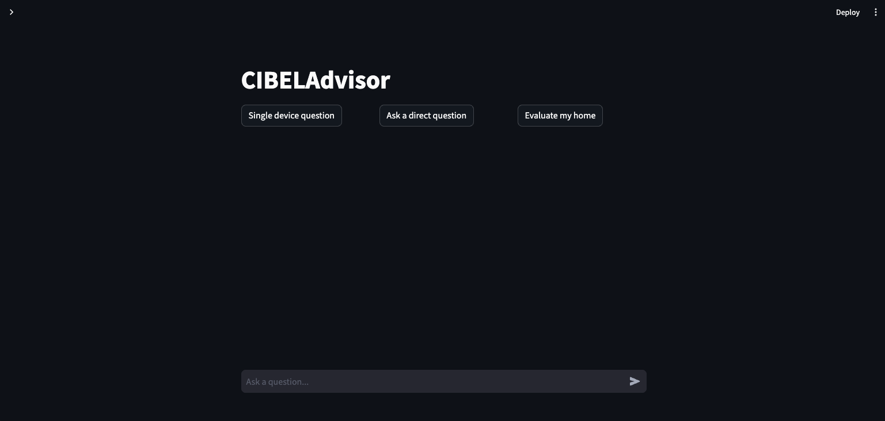
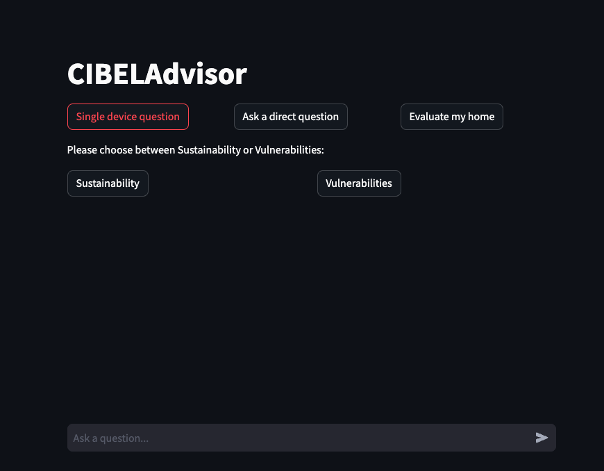
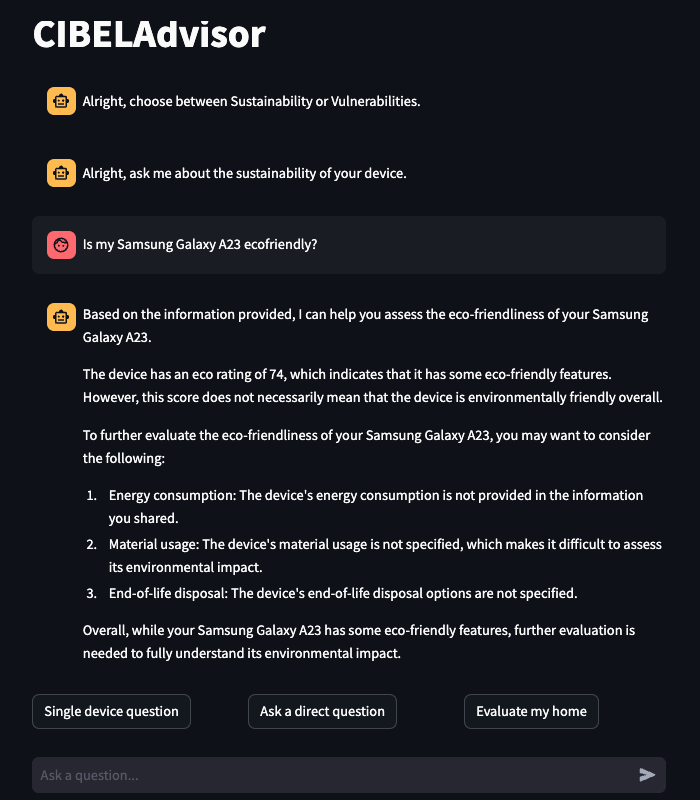
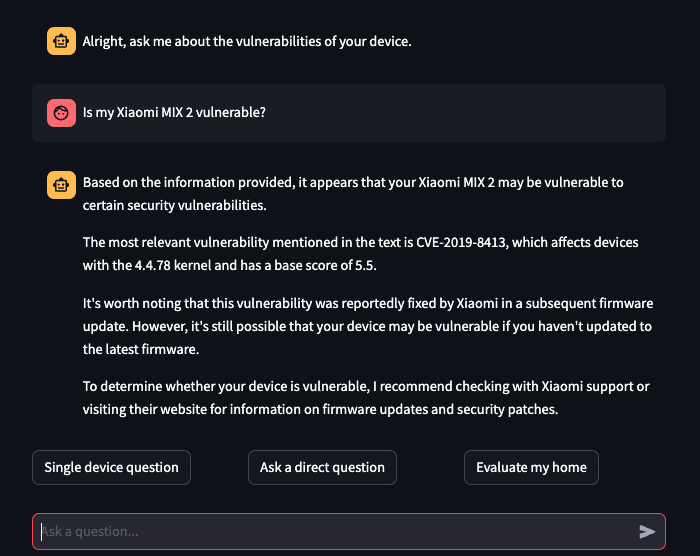
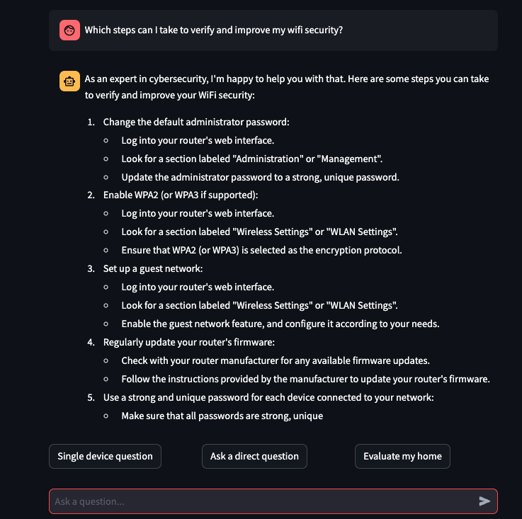
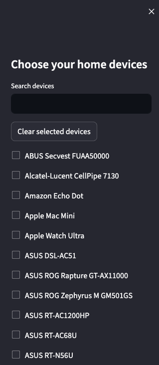
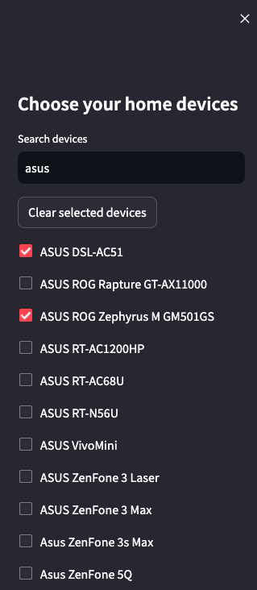
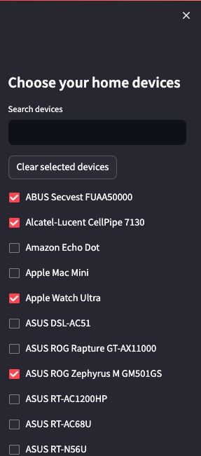
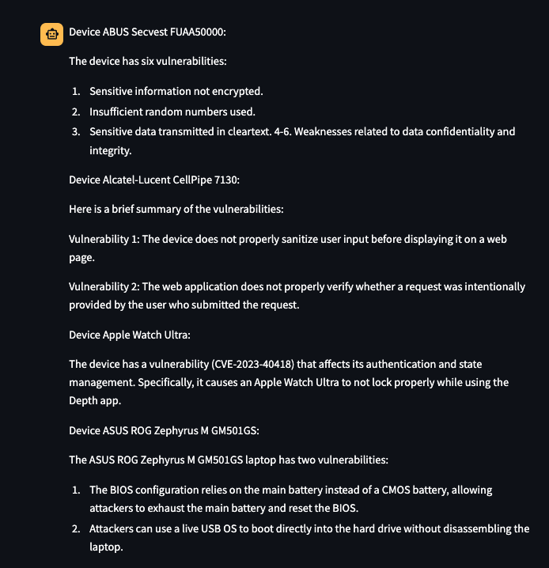

# CIBELAdvisor 

## Descripción
Se trata de una aplicación orientada a actuar como asistente de ciberseguridad y sostenibilidad especialmente respecto a dispositivos que el usuario tenga en su casa. Sin embargo, también se le pueden realizar preguntas genéricas sobre ciberseguridad.

## Uso con DOCKER (Solo con Gemini)
Descargamos imagen:
- docker pull albertom02/cibeladvisor-gemini

NOTA: Para conseguir acceso a una key (La cual deberás poner en lugar de "MI-KEY"), solicita una API Key de Gemini aquí: https://aistudio.google.com/app/apikey 

La ejecutamos:
- docker run -p 8501:8501 -e USER_SECRET_KEY=“MI-KEY” albertom02/cibeladvisor-gemini:latest

Accedemos a la página web donde estará disponible la aplicación:
- http://localhost:8501

## Uso descargando el código 
Para utilizar la aplicación, se invoca con el comando:

- Versión Llama:
  - streamlit run fichero.py "Ubicación/Modelo"
    
  Por ejemplo:
  - streamlit run streamlitappV4.py "Modelos/Meta-Llama-3-8B-Instruct-Q8_0.gguf"
 
- Versión Gemini:
  - streamlit run fichero.py

  Por ejemplo:
  - streamlit run streamlitappV4_Gemini.py
 
NOTA: Se debe declarar la API-Key de Gemini para que pueda ser usada en el código de la siguiente manera:

- export USER_SECRET_KEY="MI-KEY"

## Datos Técnicos
La aplicación está desarrollada con Streamlit, se apoya en un LLM y un RAG, una chain de Langchain que utiliza diversos documentos con información sobre vulnerabilidades y sostenibilidad, para poder proporcionar información más técnica y/o de actualidad al LLM en tiempo
de ejecución.
Se dispone de dos versiones.
- Versión con LLama: Se trata de una versión pensada para ejecutar un modelo LLama Instruct con formato GGUF en local, según las características del dispositivo que dispongamos. Lógicamente, cuanto mejor sea el modelo, y por ende generalmente más pesado,
  mejor calidad tendrán las respuestas. La ruta al modelo se pasará como argumento al ejecutar la aplicación.
- Versión con Gemini: Esta versión funciona de igual manera pero en este caso ejecuta un modelo Gemini de manera remota. Para ello, se requiere obtener una Secret Key con acceso a la API e indicarla.

## Funciones
En la aplicación disponemos de varias funciones según la asistencia que requiera el usuario:

- Ventana de Inicio: Nos muestra una entarda de chat en la que podemos hacer una pregunta cualquiera al LLM, o bien 3 botones según queramos que evalue nuestra casa, hacerle una pregunta directa sobre ciberseguridad o bien preguntarle por un dispositivo en particular.

- Preguntar por un diaspositivo: Si seleccionamos "Single Device question", se nos hablitarán dos nuevos botones para seleccionar si se trata de una pregunta sobre sostenibilidad o vulnerabilidades.

- Sostenibilidad: Si seleccionamos "Sustainability" e introducimos una pregunta, se nos responderá en base a la información que disponemos sobre sostenibilidad para un dispositivo en particular.

- Vulnerabilidades: Si seleccionamos "Vulnerabilities" e introducimos una pregunta, se nos responderá en base a la información que disponemos sobre vulnerabilidades para un dispositvo en particular.

- Direct Question: Si seleccionamos "Ask a Direct Question", podremos preguntar cualquier cosa relacionada con ciberseguridad al modelo.

- Barra lateral: La aplicación también dispone de un desplegable de barra lateral el cual nos permite acceder al listado de dispositivos a seleccionar, lo cual se utiliza para que evalúe nuestra casa.

- Búsqueda: En la barra lateral podemos buscar y seleccionar los dispositivos que tengamos y que se encuentren en la aplicación.

- Evaluar casa (selección): Para que evalúe nuestra cada seleccionamos los dispositivos que poseemos en la barra lateral.

- Evaluar casa (respuesta): Una vez seleccionados los dispositivos que componen nuestra casa, seleccionamos el botón "Evaluate my home" y esperamos que evalúe los dispositivos y nos muestre una respuesta.

## Recomendación
- Se recomienda usar los modelos "Meta-Llama-3-8B-Instruct-Q8_0.gguf" o "Llama-3.3-70B-Instruct-IQ1_M.gguf" para ejecución local con Llama.

## Dependencias

En la carpeta CondaEnvs se encuentran los ficheros ".yml" para generar los entornos con las dependencias necesarias para ejecutar el programa.
- "Gemini-env.yml": Para la versión de Gemini.
- "llama-env.yml": Para la versión de llama.
